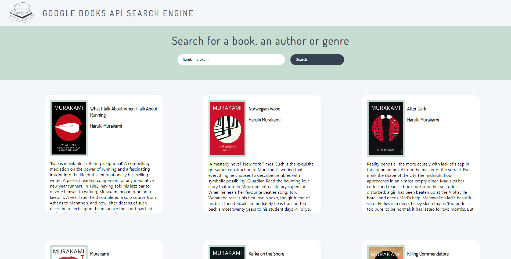

### Google Books API Search Engine Project

-   This projects allows the user to search for a book using the Google Books API. When clicking on a book, more details are displayed and if no results are found, feedback is provided. The App was made using React and styling with SASS and uses async/await for the request and renders the books in a grid.

# TO DO:

-   Separate Book Modal from BookCard.
-   Fix display of multiple authors.
-   Fix modal when info overflows.
-   Provide a way to exit the modal other than toggling the book.
-   Provide more than 10 results.
